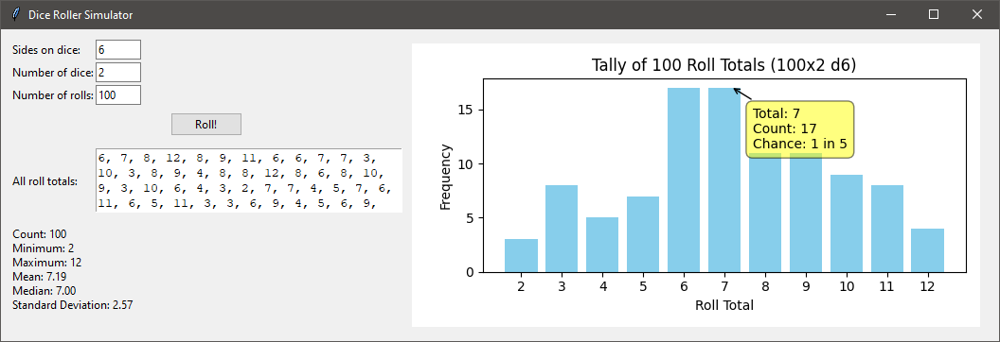

# 🎲 Dice Roller Simulator

A fun and interactive dice simulator built with Python, Tkinter, and Matplotlib.  
Simulate thousands of custom dice rolls and visualize the results with real-time stats and interactive charts.



---

## 🧰 Features

- 🎲 Simulate rolling any number of dice with custom sides
- 📊 View detailed summary statistics: mean, median, standard deviation
- 📈 Interactive bar chart with tooltips using `mplcursors`
- 🖥️ Responsive and easy-to-use Tkinter GUI

---

## 🚀 Getting Started

### 1. Clone the Repository

```bash
git clone https://github.com/ArpyClarkson/dice-roller-simulator.git
cd dice-roller-simulator
```

### 2. Install Dependencies

```bash
pip install -r requirements.txt
```

### 3. Run the App

```bash
python diceroller.py
```

## 📜 License
Open source under the MIT License.
Made with Python by @ArpyClarkson
